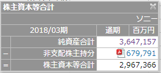
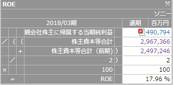
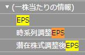

export { dark as theme } from 'mdx-deck/themes'
import NonControllingInterestFormula from './components/NonControllingInterestFormula.jsx'

# Finance Tips

Yoshihiro Ueki

---

### 非支配株主持分 とは
連結決算における、子会社の純資産のうち、親会社持ち分以外のこと。([出所][]) 
[出所]: http://renketsu.info/capital-consoli/non-controlling-interest/
SPEEDAでは、純資産にある、株主資本等合計の計算で使われている

 
子会社資本全体 - 親会社の持つ子会社株式 = 非支配株主持分

---

## (おまけ) 非支配株主持分フォーミュラ

<NonControllingInterestFormula />

---

## 期初期末平均とは
ROE, ROA, 総資産経常利益率で使われている。時点ではなく、期間を対象に値を求めたいときに、期初期末の平均をして使用する。よく似た表現に期中平均がある。
- 期初データ＝前期末データのため、前期末の貸借対照表から使用する
- 期中の変動が少ない場合には差がでないため、期初期末平均を使わなくてもよい

---

## WACC(加重平均資本コスト)とは
- 負債コストと株主資本コストの加重平均から求める
- 意味は、債権者と株主の要求に答え、共に満足させることができるコスト
- WACCの目安は5〜8%。WACCが高いと投資家はリターンを高く求めていると言える
- 負債コスト < 株主資本コスト

---

## WACC(加重平均資本コスト)イメージ
- 出所: https://globis.jp/article/4551

---

## WACC(加重平均資本コスト)計算式
- 出所： https://hodai.globis.co.jp/courses/dd20181b

---

## EPS（1株当たり利益）とは
- EPS（円） ＝ 当期純利益 ÷ 発行済株式総数
- 計算式から分かるように、利益を上げる、もしくは、自社株買いをしても値が増加する。
- 時系列調整EPS、潜在株式調整後EPS（転換社債やワラント等、将来増加する可能性のある普通株式を含めたEPS)

---

### PER（株価収益率）とは

---

## ROE, ROA とは
効率性科目
- 解説
- 使われ方

---

## Image

---

### Fin
###### powered by SPEEDA
###### powered by mdx-deck
