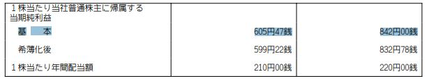
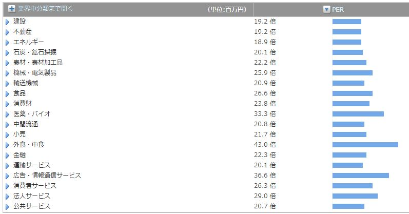

export { dark as theme } from 'mdx-deck/themes'
import NonControllingInterestFormula from './components/NonControllingInterestFormula.jsx'
import {
  Invert,
  Split,
  SplitRight,
  Horizontal,
  FullScreenCode,
} from '@mdx-deck/layouts'

# Finance Tips

Yoshihiro Ueki

---

### 非支配株主持分 とは
連結決算における、子会社の純資産のうち、親会社持ち分以外のこと。([出所][]) 
[出所]: http://renketsu.info/capital-consoli/non-controlling-interest/
SPEEDAでは、純資産にある、株主資本等合計の計算で使われている

 
子会社資本全体 - 親会社の持つ子会社株式 = 非支配株主持分

---

## (おまけ) 非支配株主持分フォーミュラ

<NonControllingInterestFormula />

---

## 期初期末平均とは
ROE, ROA, 総資産経常利益率で使われている。時点ではなく、期間を対象に値を求めたいときに、期初期末の平均をして使用する。よく似た表現に期中平均がある。
- 期初データ＝前期末データのため、前期末の貸借対照表から使用する
- 期中の変動が少ない場合には差がでないため、期初期末平均を使わなくてもよい

---

## WACC(加重平均資本コスト)とは
- 負債コストと株主資本コストの加重平均から求める
- 意味は、債権者と株主の要求に答え、共に満足させることができるコスト
- WACCの目安は5〜8%。WACCが高いと投資家はリターンを高く求めていると言える
- 負債コスト < 株主資本コスト

---

## WACC(加重平均資本コスト)イメージ
- 出所: https://globis.jp/article/4551

---

## WACC(加重平均資本コスト)計算式
- 出所： https://hodai.globis.co.jp/courses/dd20181b

---

## EPS(1株当たり利益)とは

- EPS（円） ＝ 当期純利益 ÷ 発行済株式総数
- 計算式から、利益を上げる、もしくは、自社株買い＆償却をして値が増加する。
- 逆に、減益や増配によって減少。
- 時系列調整EPS、潜在株式調整後EPS（新株予約権付社債という将来増加する可能性のある普通株式を含めたEPS)

--- 

<Split>

  
SPEEDA(財務>会社データ)

  

  
有価証券報告書（抜粋）

  

</Split>

---

### PER（株価収益率）とは
- PER（倍） = 株価(1株あたりの相場価格) ÷ EPS(1株当たり利益) 
- 　　　　　= 時価総額 ÷ 当期純利益
- PERは投資家の期待値。株価が会社稼ぎの何倍か。
- UBは128倍(業界40~55倍)。日経平均は現在12～13倍の相場
- PERは業界によって目安となる基準の倍率は異なる

---

### おまけ：関連の近い指標
- BPS(1株当たり純資産：Book value Per Share）= 純資産 ÷ 発行済株式総数
- PBR（株価純資産倍率：Price Book value Ratio）= 株価 ÷ BPS
- DPS(Dividend Per Share：1株当たりの配当額) = 配当金 ÷ 発行済株式総数
- 配当性向（％）= 配当額 ÷ 当期純利益
- 　　　　　　　= DPS ÷ EPS × 100（※倍率で表現せず%のため）

---

## ROE(Return On Equity：自己資本利益率) とは
- ROE(%) = 当期純利益 ÷ 自己資本 × 100
- ※ Equityは株主資本の意味だが、2006年に明確な定義が定まり、直訳と異なる。
- お金を集める（自己資本・他人資本）→投資する（資産になる）→利益になる。
- いかに効率よく自己資本を利益に変えているか。
- 自己資本を,純資産合計で計算してしまうこともある(ROE = PBR ÷ PER)

---

## SPEEDAの計算(企業＞財務諸表＞効率性科目)

- 厳密には少しずれるが、問題になることはほぼないと考えてよい。
- 参考：https://globis.jp/article/5067

---

## おまけ：ROA

- EquityがROEだったのに対し、ROAはAssets(総資産。※純資産ではない)

---

### ベータ、アンレバードベータ

---

## Image

---

### Fin
###### powered by SPEEDA
###### powered by mdx-deck
