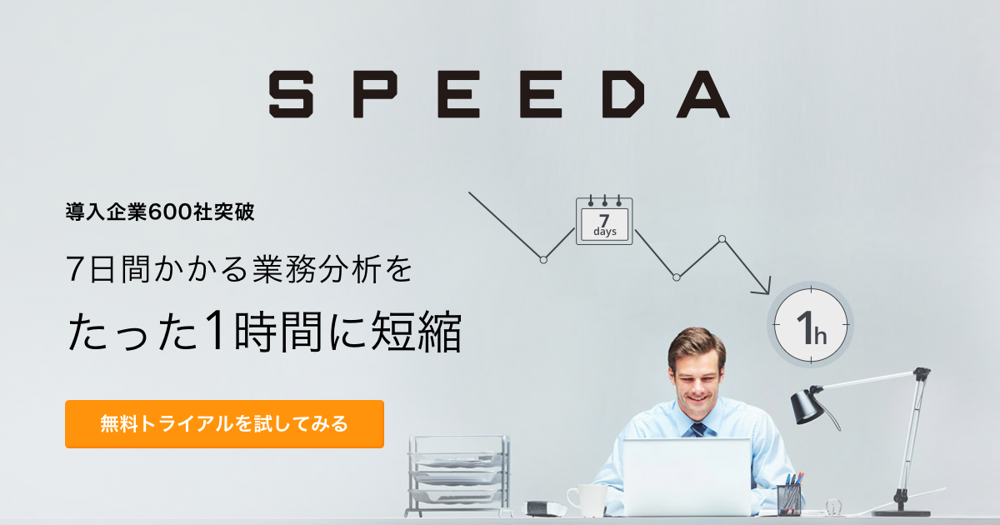

export { dark as theme } from 'mdx-deck/themes'
import NonControllingInterestFormula from './components/NonControllingInterestFormula.jsx'

# Finance Tips

Yoshihiro Ueki

---

### 非支配株主持分 とは
連結決算における、子会社の純資産のうち、親会社持ち分以外のこと。([出所][]) 
[出所]: http://renketsu.info/capital-consoli/non-controlling-interest/
SPEEDAでは、純資産にある、株主資本等合計の計算で使われている

 
子会社資本全体 - 親会社の持つ子会社株式 = 非支配株主持分

---

## (おまけ) 非支配株主持分フォーミュラ

<NonControllingInterestFormula />

---

## 期初期末平均とは
SPEEDAのフォーミュラでは、いろんなところで使われてる
- 解説
- メリット
- デメリット

---

## EPS（1株当たり利益）とは
SPEEDAの会社データタブ
- その 1
- その 2
- その 3

---

## ROE, ROA とは
効率性科目
- 解説
- 使われ方

---

## Image

---

### Fin
###### powered by SPEEDA
###### powered by mdx-deck
